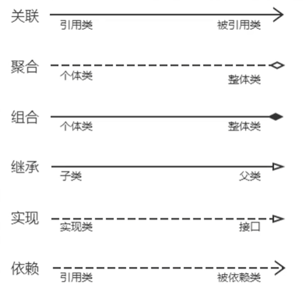

### 概念

> 什么是`UML`?

统一建模语言 (`Unified Modeling Language`, `UML`) 是一种为面向对象系统的产品进行说明、可视化和编辑文档的一种标准语言，是非专利的第三代建模和规约语言。

`UML`使用面向对象设计的建模工具，但独立于任何具体程序设计语言。

> UML绘图规范

UML学习文档：https://plantuml.com/zh/
- UML
    - 关系
        - 关联
            - 概念：关联 (`Association`) 表示关联关系，是一种拥有的关系，具有方向性。
            - 种类
                - 单向关联：用带有普通箭头的实线表示，箭头指向被拥有者。
                - 双向关联：不带有普通箭头的实线，或者双向带有普通箭头的实线表示。
        - 聚合
            - 概念：聚合 (`Aggregate`) 表示整体与部分的关系。
            - 用带空心菱形的实线表示，菱形指向整体，箭头指向个体。
        - 组合
            - 概念：组合 (`Combination`) 表示整体与部分的关系，组合比聚合更加严格。
            - 用带实心菱形的实线表示，菱形指向整体，箭头指向个体。
        - 泛化
            - 概念：泛化 (`Generalization`) 表示一个更泛化的元素和一个更具体的元素之间的关系，与继承是同一个概念。
            - 用带空心三角箭头的实线表示，箭头指向父类。
        - 实现
            - 概念：实现 (`Realization`) 表示类与接口的关系，类实现接口。
            - 用带空心三角箭头的虚线表示，箭头指向父类接口。
        - 依赖
            - 概念：依赖 (`Dependency`) 表示如果一个类的改动会影响到另一个类，则两个类之间存在依赖关系，一般而言，依赖是单向的。
            - 用带普通箭头的虚线表示，箭头指向被依赖者。
    - 事物
        - 结构事物
            - 类 (Class Diagrams)
                - `+` 表示`public`
                - `-` 表示`private`
                - `#` 表示`protected`
                - `~` 表示`default`，可以省略不写
                - 字段和方法返回值的数据类型非必须
                - 抽象类或抽象方法用斜体表示
                - 静态类或静态方法加下划线
                - 如果是接口，在类名上方加`<<Interface>>`
            - 接口
            - 用例
            - 协作
            - 组件
            - 活动类
            - 节点
        - 行为事物
            - 交互
            - 状态
        - 分组事物
            - 包
    - 图
        - 结构图
            - 静态图
                - 类图
                - 对象图
                - 包图(UML2.0新增)
            - 实现图
                - 构件图
                - 部署图+
            - 组合结构图(UML2.0新增)
        - 行为图
            - 活动图
            - 状态图
            - 用例图
        - 交互图
            - 时序图
            - 时间图(UML2.0新增)
            - 交互概念图(UML2.0新增)
            - 协作图

#### 类图中的关系表示

#### 时序图

> 定义

时序图描述对象之间消息的发送顺序，强调时间顺序。时序图是一个二维图，横轴表示对象，纵轴表示时间，消息在个对象之间横向传递，依照时间顺序纵向排序。 

用箭头表示消息、用竖虚线表示对象生命线。
> 作用

1、展示对象之间交互的顺序。将交互行为建模为消息传递，通过描述消息是如何在对象间发送和接收的来动态展示对象之间的交互; 
2、相对与其他`UML`图，时序图更强调交互的时间顺序; 
3、可以直观的描述并发进程。

> 时序图的组成元素

- 角色 (Actor)
- 对象 (Object)
- 生命线 (Lifeline)
- 控制焦点 (Focus of Control)
- 消息 (Message)
- 自关联消息
- 组合片段

> 时序图组成元素之组合片段

| 片段类型     | 名称  | 说明                                                                                                                           |
|----------|-----|------------------------------------------------------------------------------------------------------------------------------|
| Opt      | 选项  | 包含一个可能发生或者不发生的序列。可以在临界值中指定序列发生的条件。                                                                                           |
| Alt      | 抉择  | 包含一个片段列表，这些片段包含备选消息序列。在任何场合下只发生一个序列。可以在每个片段中设置一个临界来指示该片段可以运行的条件。else的临界指示其他任何临界豆不为True时运行的片段。如果所有临界都为False并且没有else，则不执行任何片段。 |
| Loop     | 循环  | 片段重复一定次数。可以在临界中指示片段重复的条件。Loop组合片段具有 "Min" 和 "Max" 属性，它们指示片段可以重复的最小和最大次数。默认值是无限制。                                             |
| Break    | 中断  | 如果执行此片段，则放弃序列的其余部分。可以使用临界来指示发生中断的条件。                                                                                         |
| Par      | 并行  | 并行处理。片段中的事件可以交错。                                                                                                             |
| Critical | 关键  | 用在Par或Seq片段中。指示此片段中的消息不得与其他消息交错。                                                                                             |
| Seq      | 弱顺序 | 有两个或更多操作数片段。涉及同一生命线的消息必须以此片段的顺序发生。如果消息涉及的生命线不同，来自不同片段的消息可能会并行交错。                                                             |
| Strict   | 强顺序 | 有两个或更多操作数片段。这些片段必须按给定顺序发生。                                                                                                   |
| Consider | 考虑  | 指定此片段描述的消息列表。其他消息可发生在运行的系统中，但对此描述来说意义不大。在 "Message" 属性中键入该列表。                                                                |
| Ignore   | 忽略  | 此片段未描述的消息列表。这些消息可发生在运行的系统中，但对此描述来说意义不大。在 "Message" 属性中键入该列表。                                                                 | 
| Assert   | 断言  | 操作数片段指定唯一有效的序列。通常用在Consider或Ignore片段中。                                                                                       |
| Neg      | 否定  | 此片段中显示的序列不得发生。通常用在Consider或Ignore片段中。                                                                                        |
