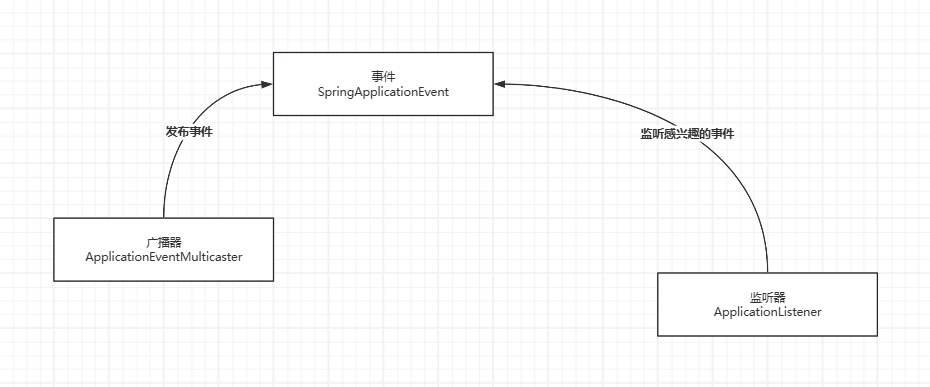

# SpringBoot核心源码
## 1.1 流程入口
```java
SpringApplication.run(DemoApplication.class, args);
```
```java
return new SpringApplication(primarySources).run(args);
```
> 主要方法
```text
(1) WebApplicationType.deduceFromClasspath()                    : 判断当前Spring工程的类型: REACTIVE | NONE | SERVLET
(2) private List<ApplicationContextInitializer<?>> initializers : 初始化器
(3) private List<ApplicationListener<?>>           listeners    : 监听器
```
```java
public SpringApplication(ResourceLoader resourceLoader, Class<?>... primarySources) {
    this.resourceLoader = resourceLoader;
    Assert.notNull(primarySources, "PrimarySources must not be null");
    // 将primarySources数组包装成List，然后再包装成LinkedHashSet
    this.primarySources = new LinkedHashSet<>(Arrays.asList(primarySources));
    // 判断当前Spring工程的类型：REACTIVE, NONE, SERVLET
    // 最终this.webApplicationType = SERVLET
    this.webApplicationType = WebApplicationType.deduceFromClasspath();
    this.bootstrapRegistryInitializers = new ArrayList<>(
            getSpringFactoriesInstances(BootstrapRegistryInitializer.class));
    setInitializers((Collection) getSpringFactoriesInstances(ApplicationContextInitializer.class));
    setListeners((Collection) getSpringFactoriesInstances(ApplicationListener.class));
    this.mainApplicationClass = deduceMainApplicationClass();
}
```

## 1.2 初始化器 ApplicationContextInitializer
> 在new SpringApplication中，通过`getSpringFactoriesInstances()`获取初始化器，Spring容器执行`refresh()`方法之前，通过context进行一些操作<br>
> `new SpringApplication()` -> `setInitializers((Collection) getSpringFactoriesInstances(ApplicationContextInitializer.class))` ->
> `run()` -> `prepareContext(...)` -> `applyInitializers(context)`

(1) 类声明
```java
@FunctionalInterface
public interface ApplicationContextInitializer<C extends ConfigurableApplicationContext> {

	/**
	 * Initialize the given application context.
	 * @param applicationContext the application to configure
	 */
	void initialize(C applicationContext);
}
```
(2) 自定义初始化器
```java
public class DemoContextInitializer implements ApplicationContextInitializer {
    
    @Override
    public void initialize(ConfiguratableApplicationContext applicationContext) {
        System.out.println("自定义初始化器执行...");
        // 设置环境变量
        ConfigurationEnvironment environment = applicationContext.getEnvironment();
        Map<string, String> map = new HashMap<>();
        map.put("name", "jack");
        environment.getPropertySources().addLast(new MapPropertySource("demoContextInitializer", map));
        System.out.println("demoContextInitializer execute, and add some property");
    }
}
```
(3) 通过SPI机制将自定义初始化器交给list集合initializers<br>
文件：/META-INF/spring.factories
```yaml
org.springframework.context.ApplicationContextInitializer=\
  com.kale.initializer.DemoContextInitializer
```

## 1.3 监听器 ApplicationListener

(1) 自定义监听器
```java
// ApplicationStartingEvent -> 容器启动事件
public class DemoApplicationListener implements ApplicationListener<ApplicationStartingEvent> {
    
    @Override
    public void onApplicationEvent(ApplicationStartingEvent event) {
        // 监听器回调
        System.out.println("demoApplicationListener 容器正在启动...");
    }
}
```
```java
public class Demo2ApplicationListener implements ApplicationListener<ApplicationStartedEvent> {
    
    @Override
    public void onApplicationEvent(ApplicationStartedEvent event) {
        // 监听器回调
        System.out.println("demo2ApplicationListener 容器启动完成...");
    }
}
```
(2) 通过SPI机制将自定义监听器交给list集合listeners
```yaml
org.springframework.context.ApplicationListener=\
  com.kale.listener.DemoApplicationListener,
  com.kale.listener.Demo2ApplicationListener
```

## 1.4 Runner
(1) 类声明
```java
@FunctionalInterface
public interface ApplicationRunner {

	/**
	 * Callback used to run the bean.
	 * @param args incoming application arguments
	 * @throws Exception on error
	 */
	void run(ApplicationArguments args) throws Exception;
}

@FunctionalInterface
public interface CommandLineRunner {

    /**
     * Callback used to run the bean.
     * @param args incoming main method arguments
     * @throws Exception on error
     */
    void run(String... args) throws Exception;
}
```

(2) Runner分为ApplicationRunner和CommandLineRunner<br>
> 相同点
- 两者是需要通过注入ioc容器中使用的
- 执行顺序都是在容器启动完成后执行，具体的执行顺序可以通过`@Order`指定，value越小权重越高
> 不同点
- `ApplicationRunner`的参数类型更加灵活和方便，有更强大的参数处理能力
- `CommandLineRunner`的参数是原始参数，适用简单的参数场景

(3) 自定义Runner
```java
@Component
public class DemoApplicationRunner implements ApplicationRunner {
    
    @Override
    public void run(ApplicationArguments args) {
        // 获取原始参数，原始参数，如：--foo=bar 100 200 --debug，返回：["--foo=bar", "100", "200", "--debug"]
        // args.getSourceArgs() -> String[]
        
        // 获取参数名称，如：--foo=bar --debug，返回：["foo", "debug"]
        // args.getOptionNames() -> Set<String>
        
        // 是否包含某个参数
        // args.containsOption(name) -> boolean
        
        // 获取选项参数的所有值，如：--foo=bar --foo=baz，返回：["bar", "baz"]
        // args.getOptionValues(name) -> List<String>
        
        // 获取无选项参数的所有值，如：--foo=bar 100 200 300，返回：["100", "200", "300"]
        // args.getNonOptionArgs() -> List<String>
    }
}

@Component
public class DemoCommandLineRunner implements CommandLineRunner {

    @Override
    public void run(String[] args) {
        // args -> 原始参数，如：--foo=bar 100 200 --debug，返回：["--foo=bar", "100", "200", "--debug"]
    }
}
```

## 2.1 AbstractApplicationContext#refresh()方法
(1) `obtainFreshBeanFactory()` 创建BeanFactory
```java
// 默认创建DefaultListableBeanFactory
ConfigurableListableBeanFactory beanFactory = obtainFreshBeanFactory();
```
(2) `prepareBeanFactory(beanFactory)` 设置beanFactory的默认值
```java
protected void prepareBeanFactory(ConfigurableListableBeanFactory beanFactory) {
    // Tell the internal bean factory to use the context's class loader etc.
    beanFactory.setBeanClassLoader(getClassLoader());
    if (!shouldIgnoreSpel) {
        beanFactory.setBeanExpressionResolver(new StandardBeanExpressionResolver(beanFactory.getBeanClassLoader()));
    }
    beanFactory.addPropertyEditorRegistrar(new ResourceEditorRegistrar(this, getEnvironment()));

    // Configure the bean factory with context callbacks.
    beanFactory.addBeanPostProcessor(new ApplicationContextAwareProcessor(this));
    beanFactory.ignoreDependencyInterface(EnvironmentAware.class);
    beanFactory.ignoreDependencyInterface(EmbeddedValueResolverAware.class);
    beanFactory.ignoreDependencyInterface(ResourceLoaderAware.class);
    beanFactory.ignoreDependencyInterface(ApplicationEventPublisherAware.class);
    beanFactory.ignoreDependencyInterface(MessageSourceAware.class);
    beanFactory.ignoreDependencyInterface(ApplicationContextAware.class);
    beanFactory.ignoreDependencyInterface(ApplicationStartupAware.class);

    // BeanFactory interface not registered as resolvable type in a plain factory.
    // MessageSource registered (and found for autowiring) as a bean.
    beanFactory.registerResolvableDependency(BeanFactory.class, beanFactory);
    beanFactory.registerResolvableDependency(ResourceLoader.class, this);
    beanFactory.registerResolvableDependency(ApplicationEventPublisher.class, this);
    beanFactory.registerResolvableDependency(ApplicationContext.class, this);

    // Register early post-processor for detecting inner beans as ApplicationListeners.
    beanFactory.addBeanPostProcessor(new ApplicationListenerDetector(this));

    // Detect a LoadTimeWeaver and prepare for weaving, if found.
    if (!NativeDetector.inNativeImage() && beanFactory.containsBean(LOAD_TIME_WEAVER_BEAN_NAME)) {
        beanFactory.addBeanPostProcessor(new LoadTimeWeaverAwareProcessor(beanFactory));
        // Set a temporary ClassLoader for type matching.
        beanFactory.setTempClassLoader(new ContextTypeMatchClassLoader(beanFactory.getBeanClassLoader()));
    }

    // Register default environment beans.
    if (!beanFactory.containsLocalBean(ENVIRONMENT_BEAN_NAME)) {
        beanFactory.registerSingleton(ENVIRONMENT_BEAN_NAME, getEnvironment());
    }
    if (!beanFactory.containsLocalBean(SYSTEM_PROPERTIES_BEAN_NAME)) {
        beanFactory.registerSingleton(SYSTEM_PROPERTIES_BEAN_NAME, getEnvironment().getSystemProperties());
    }
    if (!beanFactory.containsLocalBean(SYSTEM_ENVIRONMENT_BEAN_NAME)) {
        beanFactory.registerSingleton(SYSTEM_ENVIRONMENT_BEAN_NAME, getEnvironment().getSystemEnvironment());
    }
    if (!beanFactory.containsLocalBean(APPLICATION_STARTUP_BEAN_NAME)) {
        beanFactory.registerSingleton(APPLICATION_STARTUP_BEAN_NAME, getApplicationStartup());
    }
}
```
(3) `postProcessBeanFactory(beanFactory)` beanFactory的后置处理<br>
允许在此阶段进行beanFactory的操作，但是必须继承`ApplicationContext`进行扩展才能重写此方法<br><br>
(4) <span style="color: red; background: #303236; border-radius: 4px; padding: 3px 5px;">invokeBeanFactoryPostProcessors(beanFactory)</span> beanFactory的后置处理器<br>
传入beanFactory，可以自定义`BeanFactoryPostProcessor`对beanFactory进行操作<br>
> 执行完`invokeBeanFactoryPostProcessors(beanFactory)`方法，会解析当前的入口配置类，并把所有的BeanDefinition解析出来
```java
@Component
public class DemoBeanFactoryPostProcessor implements BeanFactoryPostProcessor {
    
    @Override
    public void postProcessBeanFactory(ConfiguratableListBeanFactory beanFactory) {
        // 在此扩展beanFactory
        // 1.beanFactory属性修改
        // 2.向ioc容器中注册bean
        // ......
    }
}
```
(5) `registerBeanPostProcessors(beanFactory)` 在Bean实例化前后做处理
```java
public interface BeanPostProcessor {

    // 作用在bean实例化之前
    @Nullable
    default Object postProcessBeforeInitialization(Object bean, String beanName) throws BeansException {
        return bean;
    }

    // 作用在bean实例化之后
    @Nullable
    default Object postProcessAfterInitialization(Object bean, String beanName) throws BeansException {
        return bean;
    }
}
```
应用场景举例：AOP的实现就是基于BeanPostProcessor，`AbstractAutoProxyCreator#postProcessAfterInitialization`

## 3 小结
(1) 初始化器主要作用于容器初始化阶段，并且只执行一次<br>
(2) 监听器利用了Spring的事件监听机制（观察者设计模式），在Spring事件触发的时候进行回调，对比初始化器，监听器更加灵活<br>
(3) 初始化器应用场景：配置初始化<br>
(4) 监听器应用场景：容器启动事件监听、容器启动完成事件监听、配置中心配置变更refresh等等<br>
(5) SpringBoot扩展机制
- `ApplicationContextInitializer` 初始化器
- `ApplicationListener` 事件监听机制
- `Runner` 容器启动完成后的执行器
  - `ApplicationRunner`
  - `CommandLineRunner`
- `BeanFactoryPostProcessor` BeanFactory的扩展，允许对BeanFactory进行操作
- `BeanPostProcessor` Bean的扩展，允许对bean实例化前后进行操作
- `AOP`扩展机制，是对bean的扩展，在不修改原有bean的情况下，进行前置、后置、环绕通知的织入
- `Aware`
- ......