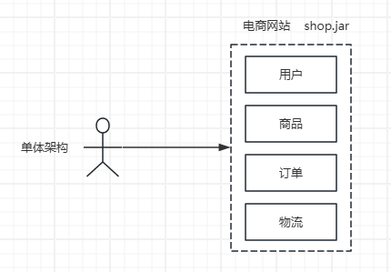
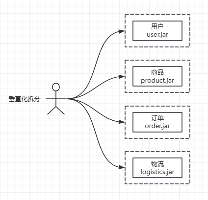
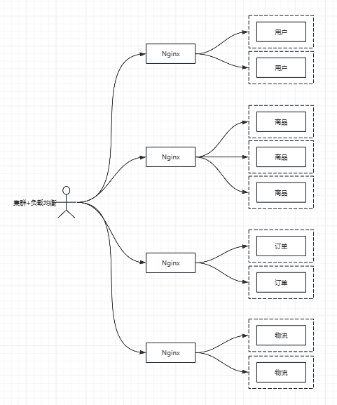
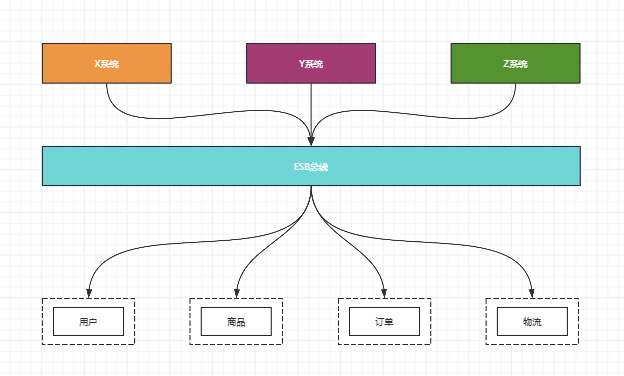
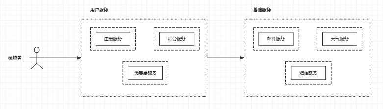
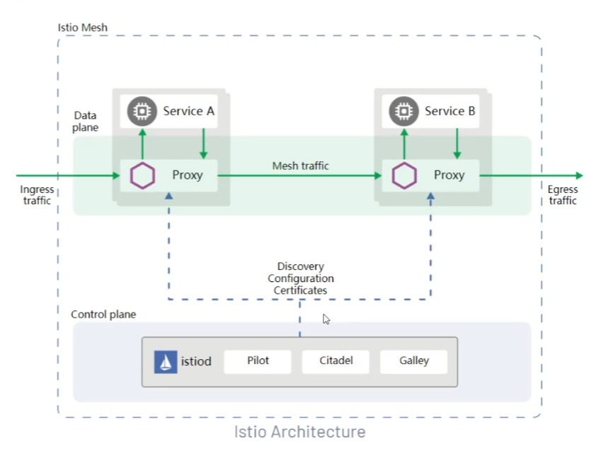

# 初识Spring Cloud

## 1、架构演进

> 单体架构

> 垂直化拆分

> 集群+负载均衡

> SOA：Service Oriented Architecture

> 微服务

> Service Mesh 服务网格的解决方式

> Istio 
> 所有的网络通信问题，流量进出都可以使用Proxy 
> Proxy组件的管理：服务注册与发现、配置管理、安全认证等等

## 2、微服务架构的定义

(1) 微服务结构是一种架构设计风格，本质上是通过多个小的服务开发一个完整的应用`[shop]` 
(2) 每个服务都会有自己独立的进程`[jar java进程]` 
(3) 这些服务因为被部署在不同的java进程、机器上，所以它们需要进行彼此间的通信`[调用]`，轻量级的通信机制，比如HTTP协议
`[其它还可以是计算机网络模型中应用层、传输层的协议，包括对这些协议的封装]`
，如BIO、NIO、Netty、Dubbo、Thrift、gRPC等、Http2、RestTemplate、OpenFeign、Okhttp、HttpClient、HttpURLConnection等 
(4) 这些服务通过自动化的机制进行部署：jenkins，加上一些容器化，利用资源，方便迁移 
(5) 这些服务的集中管理是非常少的 
(6) 这些服务可能是通过不同的编程语言开发的`[Java、Go、Python、C++等]` 异构的微服务 
(7) 这些服务可能是通过不同的数据库存储技术`[user --> db:mysql  xxx: redis、mongodb、es]`

> 微服务架构下可能需要解决的问题

**基本问题**

(1) 服务注册和发现：注册中心 
微服务所在的机器地址可能包括端口号都可能会变化：ip:port  
(2) 负载均衡

- 随机
- 轮询
- hash
- 最少访问...

(3) 服务调用

- RestTemplate
- OpenFeign
- Dubbo等

**进阶问题**

(4) 服务调用容错：超时、限流、降级、舱壁模式... 
(5) 分布式消息异步处理机制 
(6) 配置中心：配置统一管理 
共享配置，以及更改共享配置 
(7) 网关：进行路由规则的配置 
客户端访问网关，从而转发到后端的具体服务 
安全认证 
黑白名单 
限流 
降低 
... 

**其他问题**

(8) 分布式锁：跨进程之间的资源竞争互斥问题 
zookeeper、redis、etcd等 
(9) 分布式事务 
(10) 中间件 有状态的中间件 
leader follower 
leader选举和集群管理：paxos、zab、raft 
(11) 链路追踪中间件 
sleuth+zipkin、skywalking、pinpoint

## 3、分布式架构下问题的解决方案

(1) 服务注册与发现: eureka、zookeeper、nacos、consul、etcd等 
(2) 负载均衡: ribbon、nginx等 
(3) 服务调用: dubbo、thrift、feign等 
(4) 熔断: hystrix、sentinel等 
(5) 网关: zuul、gateway、kong等 
(6) 配置中心: config、nacos、apollo等 
(7) 分布式消息: rocketmq、kafka、pulsar、rabbitmq等 
(8) 分布式锁: redis、zookeeper等 
(9) 分布式事务: seata、tx-lcn等 
... 

ps: 技术更新<a href="https://landscape.cncf.io/">landscape.cncf</a>

## 4、什么是Spring Cloud

> 微服务架构下有很多问题 
> 而且这些问题也有很多的解决问题的组件 
> 针对同一个问题，有不同的厂商提供了不同的组件解决这个问题

其实对于业务代码而言，就是在SpringBoot工程中整合这些组件解决对应的问题。

> Spring Cloud生态

## 5、版本推导

https://www.processon.com/view/link/63f5f41c075f2179bc97b69b

## 6、Spring Boot与Spring Cloud版本关系

refer：https://spring.io/projects/spring-cloud#overview
details：https://start.spring.io/actuator/info

## 7、SpringCloud Alibaba、SpringCloud、SpringBoot版本关系

适配`Spring Boot 2.4+`

| Spring Cloud Alibaba Version | Spring Cloud Version  | Spring Boot Version |
|------------------------------|-----------------------|---------------------|
| 2021.0.5.0*                  | Spring Cloud 2021.0.5 | 2.6.13              |
| 2021.0.4.0                   | Spring Cloud 2021.0.4 | 2.6.11              |
| 2021.0.1.0                   | Spring Cloud 2021.0.1 | 2.6.3               |
| 2021.1                       | Spring Cloud 2020.0.1 | 2.4.2               |

适配`Spring Boot 3.x`

| Spring Cloud Alibaba Version | Spring Cloud Version  | Spring Boot Version |
|------------------------------|-----------------------|---------------------|
| 2022.0.0.0*                  | Spring Cloud 2022.0.0 | 3.0.2               |
| 2022.0.0.0-RC2               | Spring Cloud 2022.0.0 | 3.0.2               |
| 2022.0.0.0-RC1               | Spring Cloud 2022.0.0 | 3.0.0               |

## 8、最终确定版本

| 组件                   | 版本                    |
|----------------------|-----------------------|
| Spring Cloud Alibaba | 2021.0.4.0*           |
| Spring Cloud         | Spring Cloud 2021.0.4 |
| Spring Boot          | 2.7.6                 |
| Spring Framework     | 5.3.24                |
| Java                 | 8                     |