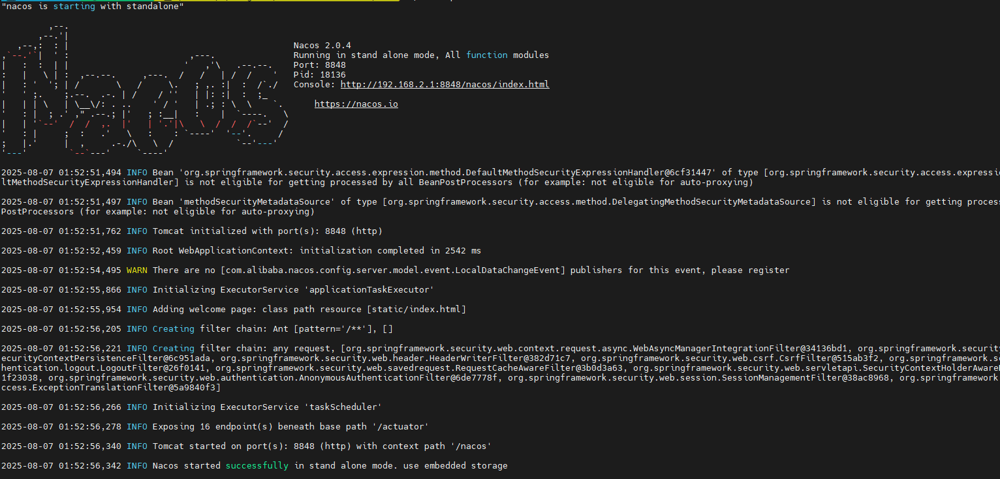

# 注册中心Nacos的使用

## 1、Nacos是什么？

`Nacos`是`Dynamic Naming and Configuration Service`的首字母简称，一个更易于构建云原生应用的动态服务发现、配置管理和服务管理平台。

## 2、Nacos架构

链接：https://nacos.io/en-us/docs/architecture.html


## 3、搭建Nacos Server

文档链接：https://nacos.io/docs/next/quickstart/quick-start/<br>
Nacos下载地址：https://github.com/alibaba/nacos/releases

> 单机版搭建

图解Nacos单机版


### 3.1 基于Centos7直接安装启动

```shell
## 下载nacos-server-2.0.4.tar.gz
wget https://github.com/alibaba/nacos/releases/download/2.0.4/nacos-server-2.0.4.tar.gz

## 解压
tar -zxvf nacos-server-2.0.4.tar.gz
```
随后得到以下结果


```shell
## 进入nacos/bin目录
cd nacos/bin

## nacos的默认启动方式为"cluster", 以单机模式启动
startup.sh -m standalone
```


打开浏览器访问：http://centosip:8848/nacos 默认用户名: nacos，密码: nacos

```shell
## 关闭nacos-server
shutdown.sh
```

### 3.2 通过源码启动

(1) 下载nacos-server源码，https://github.com/alibaba/nacos/archive/refs/tags/2.0.4.zip

(2) 解压并进入nacos目录

> 注意：在nacos-2.0.4.zip的源码版本中，nacos-console会出现编译失败的情况，是因为`spring-boot-maven-plugin`没有显示指定导致的，
> 因此，在nacos-console的pom.xml中，显示指定其中的version即可。

(3) 通过maven构建源码
```shell
mvn -Prelease-nacos -Dmaven.test.skip=true clean install -U
```

(4) 使用idea打开nacos工程

(5) 在run configuration中配置并启动Nacos
```shell
Spring Boot
Name: nacos-server-standalone
Main Class: com.alibaba.nacos.Nacos
VM options: -Dnacos.standalone=true -Dnacos.home=nacos-home-standalone
classpath of module: nacos-console
```